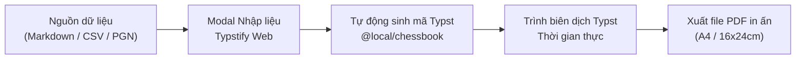

# Hướng Dẫn Sử Dụng Bộ Công Cụ Nhập Liệu & Xuất Bản Cờ Vua (Typstify Chess Studio)

Chào mừng bạn đến với bộ công cụ nhập liệu và biên soạn tài liệu cờ vua chuyên nghiệp trong **Typstify**. Hệ thống được tích hợp sẵn package cờ vua `@local/chessbook:0.1.0` giúp bạn dễ dàng tạo giáo trình, phiếu bài tập in ấn, bách khoa toàn thư khai cuộc và tạp chí cờ vua chỉ trong vài thao tác.

---

## 1. Chuyển Đổi Markdown (.md) Sang Typst Cờ Vua

Công cụ này giúp bạn chuyển đổi nhanh chóng bất kỳ bài giảng, giáo án, hoặc bài viết cờ vua viết bằng Markdown sang mã Typst hoàn chỉnh.

### 1.1. Cách mở công cụ
- Trên thanh công cụ chính (Toolbar), chọn **Nhập Markdown** (biểu tượng tệp văn bản).

### 1.2. Các tính năng nổi bật
1. **Mẫu Soạn Thảo Nhanh (Preset Templates)**:
   - **📖 Giáo trình**: Mẫu bài giảng đầy đủ với định nghĩa đòn chiến thuật, thế cờ FEN minh họa, ván đấu PGN và bảng tổng kết.
   - **📝 Phiếu bài tập**: Mẫu phiếu luyện tập A4 dành cho học sinh với các bài tập có gợi ý.
   - **📰 Tạp chí ván đấu**: Mẫu bài viết phân tích ván cờ kinh điển chuẩn phong cách tạp chí 2 cột.
   - **🏛 Khai cuộc ECO**: Mẫu tài liệu nghiên cứu biến thể khai cuộc kèm bảng biến thể nước đi.
2. **Hỗ trợ Khối Cờ Vua Thông Minh**:
   - Khối ` ```fen `: Tự động nhận diện chuỗi FEN và các thuộc tính phụ trợ (`title`, `turn`, `caption`, `arrows`).
   - Khối ` ```pgn `: Tự động nhận diện biên bản ván đấu PGN và tạo bảng 2 cột hoặc khối ván cờ.
   - Khối Callout: Chuyển đổi cú pháp `> [!CONCEPT]`, `> [!NOTE]`, `> [!IMPORTANT]` sang `#concept-box` hoặc `#instructor-note`.
   - Bảng Markdown: Tự động chuyển bảng `| ... |` sang `#table(...)` với header được định dạng đẹp mắt.
   - Ký hiệu NAG: Tự động chuyển đổi các ký tự `$14`, `±`, `⩲`, `!`, `?` sang hàm `#nag(...)` chuẩn Typst.
3. **Lựa chọn Khổ in & Mẫu tài liệu**:
   - **Sách 16x24cm**: Khổ sách tiêu chuẩn xuất bản giáo trình cờ vua.
   - **Worksheet A4**: Khổ phiếu bài tập chuẩn in văn phòng cho học sinh.
   - **Tạp chí A4**: Bố cục tạp chí 2 cột cho các bài bình luận.
   - **Đoạn trích thuần**: Chỉ chuyển đổi cú pháp, không thêm bìa sách hay header toàn cục.
4. **Xem trước mã Typst sinh ra**:
   - Chuyển sang tab **Xem trước Typst sinh ra** để kiểm tra mã nguồn trước khi chèn vào tệp hiện tại hoặc tạo tệp `.typ` mới.

---

## 2. Nhập Dữ Liệu Bài Tập (Excel / CSV / JSON / FEN)

Công cụ cho phép bạn nhập hàng chục, hàng trăm thế cờ từ file Excel/CSV, JSON hoặc danh sách FEN và tự động dàn trang sách bài tập.

### 2.1. Cách mở công cụ
- Trên thanh công cụ chính (Toolbar), chọn **Nhập dữ liệu** (biểu tượng bảng).

### 2.2. Định dạng dữ liệu được hỗ trợ

#### A. Định dạng CSV (Khuyên dùng khi xuất từ Excel/Google Sheets)
Tệp CSV cần có dòng tiêu đề (header) gồm các cột: `fen`, `title`, `turn`, `difficulty`, `hint`, `solution`.

```csv
fen,title,turn,difficulty,hint,solution
"r1bqk2r/pppp1ppp/2n5/4p3/1bB1n3/2NP1N2/PPP2PPP/R1BQK2R w KQkq - 0 6",Đòn đánh đôi,w,1,Quan sát Mã e4,1. dxe4 Bxc3+ 2. bxc3
"r1b1k2r/ppppqppp/2n5/4P3/2B2Bn1/2P2N2/P4PPP/R2Q1RK1 b kq - 0 10",Tấn công f2,b,2,Chiếu Vua,1... Qc5 2. Bxf7+ Kxf7
```

*Ghi chú về các cột:*
- `fen` *(bắt buộc)*: Chuỗi FEN vị trí quân cờ trên bàn.
- `title` *(tuỳ chọn)*: Tiêu đề bài tập (VD: "Đòn Ghim", "Chiếu bắt Hậu").
- `turn` *(tuỳ chọn)*: Bên đi trước (`w` cho Trắng, `b` cho Đen).
- `difficulty` *(tuỳ chọn)*: Độ khó từ 1 đến 5 (tương ứng với số sao ⭐).
- `hint` *(tuỳ chọn)*: Gợi ý cho học sinh.
- `solution` *(tuỳ chọn)*: Lời giải chi tiết của bài tập.

#### B. Định dạng JSON
Mảng các đối tượng bài tập:
```json
[
  {
    "fen": "r1bqk2r/pppp1ppp/2n5/4p3/1bB1n3/2NP1N2/PPP2PPP/R1BQK2R w KQkq - 0 6",
    "title": "Đòn Ghim Tượng",
    "turn": "w",
    "difficulty": 2,
    "hint": "Quan sát Mã e4",
    "solution": "1. dxe4 Bxc3+ 2. bxc3"
  }
]
```

#### C. Định dạng Danh sách FEN thuần
Mỗi dòng là một chuỗi FEN:
```text
r1bqk2r/pppp1ppp/2n5/4p3/1bB1n3/2NP1N2/PPP2PPP/R1BQK2R w KQkq - 0 6
r1b1k2r/ppppqppp/2n5/4P3/2B2Bn1/2P2N2/P4PPP/R2Q1RK1 b kq - 0 10
```

### 2.3. Bố cục dàn trang & Tùy chọn xuất bản
1. **Khổ giấy & Lưới bài tập**:
   - **Khổ A4 (12 bài/trang)**: Sắp xếp dạng lưới 3 cột x 4 hàng, tự động ngắt trang vừa vặn với kích thước ô cờ `13.5pt`.
   - **Sách 16x24cm (6 bài/trang)**: Sắp xếp dạng lưới 2 cột x 3 hàng, kích thước ô cờ `15pt` chuẩn in sách xuất bản.
2. **Tùy chọn lời giải**:
   - **In đáp án lật ngược ở chân mỗi trang**: Sử dụng hàm `#upside-down-solutions(...)` in ngược 180 độ ở cuối mỗi trang để học viên tự kiểm tra mà không bị lộ đáp án ngay.
   - **Gom toàn bộ đáp án ra phụ lục cuối sách**: Tự động tạo phần Phụ lục Lời giải (`#render-puzzle-solutions()`) ở cuối tài liệu.

---

## 3. Nhập Ván Cờ Từ PGN (`PgnImportModal`)

Dễ dàng chuyển đổi các biên bản ván đấu PGN chuẩn FIDE sang Typst:
- Chọn nút **Nhập PGN** trên Toolbar.
- Chọn 1 trong 3 định dạng xuất bản:
  1. **📰 Tạp chí (2 cột Trắng/Đen)**: Bảng nước đi 2 cột sang trọng.
  2. **📝 Biên bản ván cờ liền mạch**: Đoạn văn nước đi liên tục kèm bình luận.
  3. **📇 Thẻ thông tin ván đấu**: Bảng tóm tắt thông tin kỳ thủ, Elo, địa điểm và kết quả.

---

## 4. Xếp Bàn Cờ Trực Quan (`ChessBoardModal`)

Biên soạn thế cờ tương tác:
- Chọn nút **Xếp bàn cờ** trên Toolbar.
- Kéo thả hoặc bấm chọn quân cờ từ thanh công cụ đặt lên bàn cờ.
- Nhập nước đi mũi tên chiến thuật (VD: `e2e4`, `c4f7`).
- Chọn định dạng: Sách bài tập (Puzzle Card), Khai cuộc (ECO Diagram), Tạp chí (Column Diagram) hoặc Bàn cờ độc lập.
- Bấm **Chèn vào tài liệu** để sinh mã Typst chính xác ngay tại vị trí con trỏ soạn thảo.

---

## 5. Quy Trình Xuất Bản Tài Liệu Hoàn Chỉnh



1. Mở modal nhập liệu tương ứng.
2. Dán nội dung hoặc tải tệp từ máy tính.
3. Chọn bố cục (Khổ sách 16x24cm hoặc Khổ A4) và tùy chọn lời giải.
4. Bấm **Tạo file mới** hoặc **Chèn vào tài liệu**.
5. Xem trước bản in PDF thời gian thực trên khung xem trước bên phải.
6. Bấm nút **Xuất bản PDF** để tải về tệp PDF sẵn sàng in ấn chất lượng cao!
