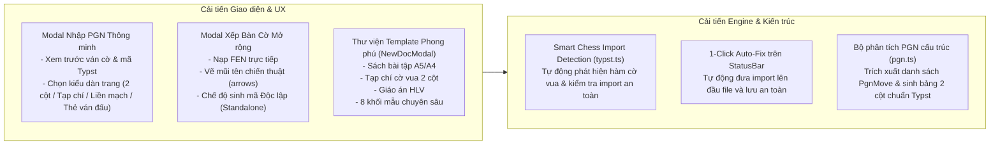

# Kế hoạch Cải thiện Tính năng Nhập PGN, Xếp Bàn Cờ, Template & Cơ Chế Biên Dịch Typst

## 1. Phân tích Hiện trạng & Nguyên nhân Gốc rễ (Root Cause Analysis)

Dựa trên phản hồi và thông báo lỗi thực tế từ hệ thống (`typst.dsc.edu.vn`), tài liệu `chess_doc.typ` gặp lỗi biên dịch `compile failed: exit status 1` bắt nguồn từ các nguyên nhân:

```mermaid
flowchart TD
    subgraph RootCauses["Nguyên nhân gây lỗi"]
        A["1. Lỗi Package @local/chessbook<br/>Gói thư viện chưa được cài hoặc không tìm thấy trên server"] --> D["Biên dịch Typst thất bại (exit status 1)"]
        B["2. Lỗi Thứ tự Khai báo Typst<br/>Gọi #game-header, #puzzle-card trước khi hàm được định nghĩa/import"] --> D
        C["3. Lỗi Vị trí Con trỏ (Cursor Insertion)<br/>Chèn PGN/Thế cờ vào giữa hoặc trên đầu các hàm cốt lõi"] --> D
        E["4. Chuỗi nước đi PGN dạng thô (#\"...\")<br/>Không dàn trang 2 cột, không linh hoạt gắn diagram"] --> F["Trải nghiệm biên soạn bị hạn chế"]
    end
```

### 1.1. Lỗi thiếu hoặc không tìm thấy Gói thư viện `@local/chessbook:0.1.0`
* **Cơ chế**: Khi người dùng tạo tài liệu mới hoặc bấm chèn từ thanh công cụ, hệ thống tự động thêm dòng `#import "@local/chessbook:0.1.0": *`.
* **Vấn đề**: Trên môi trường server web (hoặc máy cục bộ chưa chạy script cài đặt), Typst không tìm thấy thư mục package `@local/chessbook:0.1.0`. Khi import lỗi, toàn bộ các hàm `#game-header`, `#puzzle-card`, `#eco-header`, `#lesson-header`, `#wK`, `#nag` đều trở thành `unknown variable`.

### 1.2. Lỗi thứ tự khai báo hàm trong Typst (Declarative Scoping)
* Trong Typst, mã nguồn được thực thi tuần tự từ trên xuống dưới. Các hàm `#let` hoặc `#import` phải xuất hiện **trước** khi được gọi.
* Nếu người dùng dán code PGN lên dòng 1 hoặc trước các hàm khai báo, Typst sẽ dừng biên dịch ngay lập tức với lỗi `unknown variable`.

### 1.3. Bất cập trong xử lý PGN và Định dạng Nước đi
* Trước đây file `web/src/lib/pgn.ts` chỉ gom toàn bộ nước đi thành một chuỗi Typst string duy nhất: `#"1. e4 e5 2. Nf3 Nc6 ..."` kèm một số thẻ `#emph(...)`.
* Chuỗi này không thể chia cột nước đi (cột Trắng / cột Đen kiểu tạp chí), không cho phép chèn thế cờ minh họa ở các nước đi then chốt, và rất khó để người dùng tùy biến.

### 1.4. Trình Xếp bàn cờ và Template chưa linh hoạt
* `ChessBoardModal` chỉ tạo ra FEN tĩnh kèm 4 mẫu cứng nhắc mà không cho phép vẽ mũi tên chiến thuật (arrows), nạp ngược mã FEN để chỉnh sửa, hoặc chọn vị trí chèn thông minh.
* Thiếu các bộ template hoàn chỉnh theo từng thể loại xuất bản (Sách bài tập A5/A4, Tạp chí A4 2 cột, Bách khoa khai cuộc ECO, Giáo án giảng dạy HLV).

---

## 2. Kiến trúc & Giải pháp Đã Triển Khai



---

## 3. Chi Tiết Các Hạng Mục Đã Nâng Cấp

### 3.1. Nâng cấp Bộ Phân Tích & Xuất Bản PGN (`web/src/lib/pgn.ts`, `PgnImportModal.tsx`)
1. **Phân tích cấu trúc nước đi (`parseMoves`)**:
   * Phân tích SAN token thành các cặp nước đi gồm `num`, `white`, `whiteNag`, `whiteComment`, `black`, `blackNag`, `blackComment`.
2. **Đa dạng hóa định dạng xuất bản (`formatMovesAsColumns`, `gameToTypst`)**:
   * **Magazine (Tạp chí)**: Tạo bảng Typst 2 cột với số thứ tự nước đi, nước Trắng/Đen in đậm kèm ký hiệu NAG chuẩn FIDE (`#nag`) và bình luận in nghiêng (`#emph`).
   * **Inline (Liền mạch)**: Chuỗi văn bản nước đi liên tục kèm bình luận.
   * **Header Only (Thẻ ván đấu)**: Trích xuất nhanh thẻ thông tin trận đấu `#game-header`.
3. **Giao diện PgnImportModal**:
   * Hỗ trợ chọn định dạng dàn trang trực quan bằng các nút bấm lớn.
   * Hiển thị thông tin tóm tắt ván cờ (kỳ thủ, kết quả, số lượng nước đi).
   * Nút bật/tắt xem trước mã Typst (`Xem trước mã`) trước khi chèn vào tài liệu.

### 3.2. Nâng cấp Trình Xếp Bàn Cờ (`web/src/lib/chess.ts`, `ChessBoardModal.tsx`)
1. **Nạp FEN hai chiều (`fenToBoard`, `squareName`)**:
   * Hộp nhập FEN nhanh cho phép dán bất kỳ chuỗi FEN nào từ ChessBase, Lichess, Chess.com để tải thế cờ lên bàn cờ 8x8.
2. **Mũi tên chiến thuật (`arrows`)**:
   * Cho phép nhập danh sách mũi tên (ví dụ: `e2e4, c4f7, g1f3`) để xuất ra tham số `arrows: ("e2e4", "c4f7", "g1f3")` trong Typst.
3. **Chế độ Bàn cờ Độc lập (`standalone`)**:
   * Sinh mã Typst thuần sử dụng trực tiếp `@preview/board-n-pieces:0.9.0` mà không phụ thuộc vào gói `@local/chessbook`.

### 3.3. Thư viện Template Mới & Modal Khởi Tạo Tài Liệu (`NewDocModal.tsx`, `ChessToolbar.tsx`)
1. **Modal Tạo Tài Liệu Mới (`NewDocModal`)**:
   * Cung cấp 5 mẫu văn bản cờ vua hoàn chỉnh:
     * *Sách Cờ Vua Chuẩn (Khổ A5)*
     * *Tạp Chí Cờ Vua (Khổ A4 - 2 cột)*
     * *Sách Bài Tập Chiến Thuật (Khổ A5 - Lưới 2x2)*
     * *Giáo Trình Giảng Dạy HLV (Khổ A4)*
     * *Tài Liệu Typst Tối Giản (Blank)*
2. **Thanh công cụ cờ vua (`ChessToolbar`)**:
   * Bổ sung thêm các snippet thông dụng: `#concept-box` (khái niệm then chốt), `#chess-quote` (danh ngôn), `#instructor-note` (lưu ý HLV), `#practice-question` (câu hỏi trắc nghiệm).

### 3.4. Cơ Chế Chẩn Đoán Lỗi & Tự Động Sửa Import (`StatusBar.tsx`, `Editor.tsx`, `typst.ts`)
1. **Tự động nhận diện nhu cầu thư viện (`requiresChessImport`, `repairChessImports`)**:
   * Phát hiện chính xác các hàm cờ vua khi tài liệu chưa khai báo `#import`.
2. **Nút "Tự động sửa import" trên StatusBar**:
   * Khi trình biên dịch Typst hoặc LSP báo lỗi, xuất hiện nút sửa nhanh giúp chèn `#import "@local/chessbook:0.1.0": *` lên đầu file và tự động lưu.

---

## 4. Kết Quả Kiểm Thử & Xác Nhận (Verification)

* **Unit Tests (Vitest)**: 28/28 tests passed (100% thành công)
  * `web/src/lib/pgn.test.ts`: 15 tests (bóc tách ván cờ, parseMoves, formatMovesAsColumns, escape ký tự, kết quả).
  * `web/src/lib/chess.test.ts`: 7 tests (boardToFen, fenToBoard, squareName, castlingRights).
  * `web/src/lib/typst.test.ts`: 6 tests (typstString, hasChessbookImport, requiresChessImport, repairChessImports).
* **Production Build**: `npm run build` hoàn thành với `0 errors` (`dist/` được đóng gói hoàn tất).
