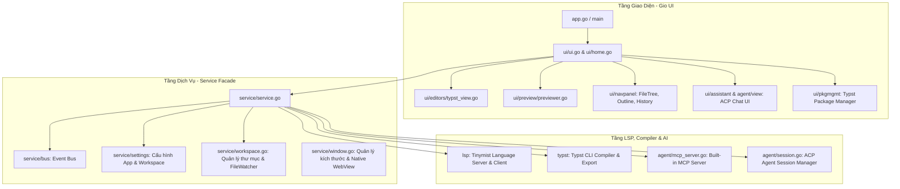

# Kế hoạch Tìm hiểu, Giới thiệu Chi tiết & Vận hành Phần mềm Typstify

## 1. Tổng quan Dự án (Project Overview)
- **Tên dự án:** Typstify
- **Mục tiêu:** Trình soạn thảo máy tính (Desktop Editor & IDE) đa nền tảng cho ngôn ngữ định dạng văn bản khoa học **Typst** (thay thế hiện đại cho LaTeX).
- **Ngôn ngữ & Công nghệ chính:**
  - **Go (1.25+ / 1.26+)** với CGO enabled.
  - **Gio UI (`gioui.org`)**: Framework giao diện người dùng Immediate Mode UI tăng tốc phần cứng (GPU D3D11/OpenGL/Vulkan/Metal).
  - **Tinymist LSP**: Giao tiếp Language Server Protocol cung cấp tính năng autocomplete, chẩn đoán lỗi (diagnostics), hover documentation, và live preview renderer.
  - **Typst CLI**: Trình biên dịch tài liệu sang PDF / PNG / SVG.
  - **Tpix SDK / CLI**: Quản lý gói thư viện và template từ Typst Universe / Tpix Registry.
  - **AI Agent (ACP & MCP Protocol)**: Tích hợp Agent Client Protocol và Model Context Protocol kết nối với Claude Code, Cline để hỗ trợ soạn thảo thông minh.
  - **bbolt**: Cơ sở dữ liệu nhúng Key-Value lưu trữ cấu hình workspace và lịch sử dự án.

---

## 2. Kiến trúc Hệ thống (System Architecture)

---

## 3. Lộ trình Triển khai (Execution Phases)

### Giai đoạn 1: Chuẩn bị & Cài đặt Môi trường (Environment Setup)
- [x] Kiểm tra Go Toolchain (đã có Go 1.26.3, CGO_ENABLED=1, GCC).
- [x] Kiểm tra Typst compiler (đã có `typst.exe` tại `C:\Users\duongsinh\.cargo\bin\typst.exe`).
- [ ] Cài đặt hoặc cấu hình `tinymist` (Typst LSP server) để kích hoạt toàn bộ tính năng LSP và Live Preview.
  - Tùy chọn 1: Cài đặt qua Cargo `cargo install --locked tinymist-cli`
  - Tùy chọn 2: Tải binary release `tinymist.exe` và đặt vào thư mục gốc hoặc PATH.

### Giai đoạn 2: Giới thiệu Chi tiết Tính năng & Cấu trúc Codebase
- [ ] Tài liệu hóa cấu trúc module trong `/docs/`:
  - `editor/`: Engine soạn thảo dựa trên `gvcode`, tích hợp highlight Chroma, tự động lưu, ruler, search.
  - `lsp/`: Quản lý tiến trình Tinymist LSP, xử lý Completion, Hover, Document Symbols, Preview Stream.
  - `agent/`: Hệ thống AI Agent hỗ trợ giao thức ACP (Agent Client Protocol) và MCP (Model Context Protocol).
  - `service/`: Kiến trúc Service Facade, quản lý Event Bus, Cài đặt, Watcher file, bbolt DB.
  - `ui/`: Các View, Dialogs, FileTree, Outline, Palette lệnh, Cửa sổ Preview, Cài đặt.
  - `i18n/`: Hỗ trợ đa ngôn ngữ.

### Giai đoạn 3: Biên dịch, Chạy thử & Kiểm thử Phần mềm (Build & Run)
- [ ] Biên dịch thử nghiệm (`go build .` hoặc `go run .`).
- [ ] Khởi chạy và kiểm tra các tính năng chính:
  - Mở workspace / thư mục dự án Typst.
  - Tạo mới file `.typ` và kiểm tra Live Preview.
  - Kiểm tra tính năng Auto-completion & Diagnostics (báo lỗi cú pháp).
  - Kiểm tra tính năng Export (PDF / PNG / SVG).
  - Kiểm tra Agent Chat / MCP nếu cần.

### Giai đoạn 4: Hướng dẫn Sử dụng & Vận hành (User Guide)
- [ ] Soạn thảo tài liệu hướng dẫn sử dụng nhanh dành cho người dùng và lập trình viên muốn mở rộng phần mềm.
