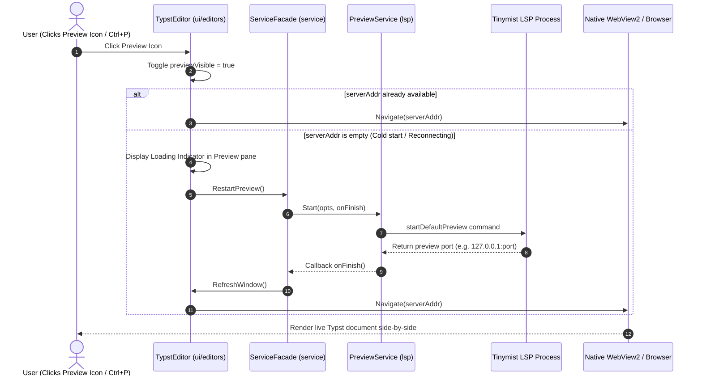

# Plan: Fix Split-View / Live Preview Functionality in Typstify

## 1. Overview & Problem Statement
When clicking the first icon on the editor toolbar (Split View / Preview) or pressing the preview shortcut (`Ctrl+P`), the editor does not react or open the preview panel.

### Root Cause Analysis
1. **LSP Server (Tinymist) Connection Timeout on Startup (`lsp/client.go`):**
   - `StartTimeout` is set to `5 * time.Second` and `ConnectTimeout` to `2 * time.Second`.
   - On Windows, `tinymist.exe` startup, TCP listener binding, and JSON-RPC initialization handshake often take longer than 5 seconds.
   - When the deadline expires, the client stops the server (`"started server, but failed to connect, stopping it"`). As a result, the LSP client is in an unready state.
2. **Silent Failure in `togglePreview` (`ui/editors/typst_view.go`):**
   - `togglePreview` checks `previewSrv.Address()`. If empty, it logs `preview ERR: no preview server address` to standard output and silently returns without triggering server start/restart or updating UI state.
3. **Missing Loading State in Preview Layout:**
   - If the preview server is starting up or reconnecting, `LayoutPreview` receives an empty address or uninitialized webview, showing blank or nothing.
4. **WebView Placement & Coordinate Invalidation:**
   - Native WebView positioning relies on `WindowContentWidth` and `ViewAreaTopOffset`. When the side panel/drawer changes or resize events occur, webview offset needs continuous sync.

---

## 2. Proposed Changes

### Phase 1: Robust LSP & Tinymist Connection (`lsp/client.go` & `lsp/previewer.go`)
- **Increase Timeout Thresholds:**
  - `StartTimeout = 25 * time.Second` (accommodating cold-start on Windows).
  - `ConnectTimeout = 1000 * time.Millisecond` (faster polling for server readiness).
- **Auto-reconnect & Retries in `PreviewService.Start`:**
  - Ensure `PreviewService.Start` waits for `client.IsReady()` with non-blocking feedback and robust retries.
  - Return informative error messages if `tinymist` cannot be started.

### Phase 2: Enhanced Preview Trigger & State Handling (`ui/editors/typst_view.go`)
- **Proactive Start on Toggle:**
  - In `togglePreview`:
    - If `serverAddr == ""`, do NOT silently drop the action.
    - Toggle `te.previewVisible = true`.
    - Trigger `te.srv.RestartPreview(context.Background(), ...)` in the background.
    - Call `te.srv.RefreshWindow()` once the preview server address is resolved so the webview automatically navigates to `serverAddr`.
- **Handle External Browser Option:**
  - If `OpenPreviewInBrowser` is configured, automatically launch the browser once the server address is ready.

### Phase 3: Preview Panel UI & Loading Indicator (`ui/editors/typst_view.go`, `ui/preview/previewer.go`, `ui/home.go`)
- **Loading / Reconnecting Overlay:**
  - If `te.previewVisible` is true but `serverAddr == ""` (preview server is still initializing), display a clean loading message (e.g., *"Starting document preview server..."*) inside the preview pane.
- **WebView Offset Synchronization:**
  - Ensure `WindowContentWidth` and `ViewAreaTopOffset` update accurately regardless of sidebar/drawer collapse state.

---

## 3. Architecture Flow

---

## 4. Step-by-Step Implementation Checklist

| Step | File | Action |
|---|---|---|
| 1 | `lsp/client.go` | Increase `StartTimeout` to `25s`, `ConnectTimeout` to `1s`. Add diagnostic logs for connection attempts. |
| 2 | `lsp/previewer.go` | Ensure `Start` gracefully handles client state and safely manages `task` address assignment with `onFinish` notification. |
| 3 | `ui/editors/typst_view.go` | Update `togglePreview` to actively start preview if address is not yet ready, toggle visibility, and show loading feedback. |
| 4 | `ui/preview/previewer.go` & `ui/home.go` | Add fallback loading UI when webview / server address is preparing, and verify coordinate calculations for native WebView2. |
| 5 | Verification | Build `typstify.exe`, open `demobook.typ`, click Preview button and press `Ctrl+P`, verify live rendering side-by-side. |

---

## 5. Verification Plan

1. **Build Verification:**
   - Run `go build -o bin/typstify.exe .` and ensure zero compile errors or warnings.
2. **Functional Test:**
   - Launch `bin\typstify.exe`.
   - Open `chessbook/demobook.typ`.
   - Click the **Split View / Preview** toolbar icon.
   - Verify that:
     1. The preview pane opens on the right side of the editor.
     2. Tinymist starts and connects without timing out.
     3. The compiled document renders live in the preview pane.
     4. Edits in the left editor immediately reflect in the preview pane.
     5. Clicking the Preview button again cleanly hides the preview pane.
