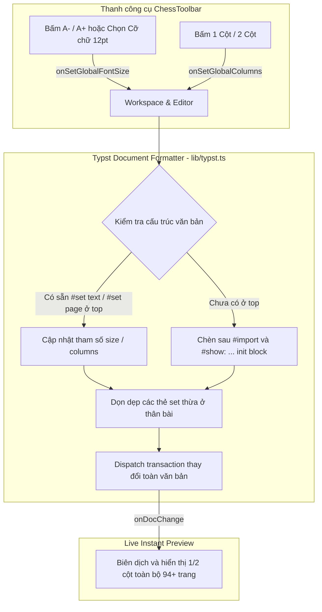

# Kế hoạch Triển khai: Áp dụng Cỡ Chữ & Số Cột Cho Toàn Bộ Văn Bản (Global Document Formatting)

## 1. Mục tiêu & Vấn đề cần giải quyết

### Vấn đề hiện tại
- Khi người dùng bấm nút **Cỡ chữ** (chọn `9pt`-`14pt`, nhập số pt, hoặc bấm `A-`/`A+`) hay **Số cột** (`1 Cột` / `2 Cột`), hệ thống hiện tại chèn câu lệnh `#set text(size: ...)` hoặc `#set page(columns: ...)` tại **vị trí con trỏ hiện tại** (`cursor position`).
- Trong các tài liệu dài (ví dụ file `bai-giang PT2M.typ` hơn 4000 dòng trong ảnh chụp của người dùng), nếu con trỏ đang ở cuối file (dòng 4054), lệnh chỉ có tác dụng cục bộ từ dòng đó trở đi, còn toàn bộ 93 trang phía trước không hề thay đổi.

### Mục tiêu cần đạt
1. **Áp dụng Toàn Văn Bản (Global Document Scope):**
   - Khi chọn **Cỡ chữ** hoặc bấm **A- / A+**: Cỡ chữ sẽ được cập nhật ở cấp độ toàn tài liệu (**Global `#set text(size: ...)`**). Toàn bộ các trang trong tài liệu sẽ tự động co giãn theo cỡ chữ mới ngay lập tức.
   - Khi chọn **Số cột (1 Cột / 2 Cột)**: Bố cục cột sẽ được áp dụng cho toàn bộ các trang trong tài liệu (**Global `#set page(columns: ...)`**).
2. **Xử lý Thông minh ở Đầu Tài Liệu (Header & Preamble Smart Handling):**
   - Tự động phát hiện vị trí đặt cấu hình chuẩn: ngay sau các dòng `#import` và khối khởi tạo `#show: ...` ở đầu tài liệu.
   - Nếu tài liệu đã có sẵn `#set text(...)` hoặc `#set page(...)`, hệ thống sẽ cập nhật trực tiếp giá trị đó mà không làm trùng lặp lệnh.
   - Tự động dọn dẹp các lệnh `#set text(...)` hoặc `#set page(columns: ...)` bị chèn rải rác giữa chừng văn bản để tránh xung đột định dạng.
3. **Phản hồi Trực quan & Xem trước Tức thì (Instant Live Preview):**
   - Khi thay đổi cỡ chữ hoặc số cột, khung xem trước (PreviewPane) lập tức biên dịch lại toàn bộ tài liệu và hiển thị layout 1 cột hoặc 2 cột trên toàn bộ các trang.
4. **Giữ Tùy chọn Cục bộ khi Cần Thiết:**
   - Trong menu "Số cột", mục *"Khối 2 Cột theo đoạn (Grid)"* và *"Khối 2 Cột (Lý thuyết + Bàn cờ)"* vẫn được giữ lại trong phần công cụ nâng cao để người dùng có thể chèn khung 2 cột cho riêng 1 bài tập hoặc 1 đoạn ngắn khi có chủ đích.

---

## 2. Thiết kế Kỹ thuật



---

## 3. Các thay đổi đề xuất

### A. Core Library (`web/src/lib/typst.ts` & `web/src/lib/typst.test.ts`)

#### 1. [MODIFY] `web/src/lib/typst.ts`
* Thêm các hàm xử lý định dạng toàn cục:
  1. `detectDocumentFontSize(doc: string): number`: Phân tích cỡ chữ hiện tại của tài liệu (mặc định trả về `11` nếu chưa thiết lập).
  2. `detectDocumentColumns(doc: string): 1 | 2`: Phân tích số cột hiện tại của tài liệu (1 hoặc 2).
  3. `applyGlobalFontSize(doc: string, sizePt: number | string): string`: Cập nhật/chèn `#set text(size: ...pt)` ở phần đầu tài liệu, xóa bỏ các lệnh `#set text(size: ...)` bị chèn thừa ở thân bài.
  4. `applyGlobalColumns(doc: string, columns: 1 | 2, gutter?: string): string`: Cập nhật/chèn `#set page(columns: ...)` ở phần đầu tài liệu, xóa bỏ các lệnh `#set page(columns: ...)` thừa ở thân bài.

#### 2. [NEW] Thêm Unit Tests trong `web/src/lib/typst.test.ts`
* Kiểm tra việc chèn mới vào tài liệu chưa có `#set`.
* Kiểm tra việc cập nhật tài liệu đã có `#set text` hoặc `#set page`.
* Kiểm tra việc dọn dẹp các lệnh `#set text` / `#set page` bị chèn ở giữa chừng văn bản.
* Kiểm tra tính toán tăng giảm `A-` / `A+`.

---

### B. Editor Component (`web/src/components/Editor.tsx`)

#### 1. [MODIFY] `web/src/components/Editor.tsx`
* Bổ sung các phương thức vào `EditorHandle`:
  - `setGlobalFontSize: (size: string | number) => void`
  - `setGlobalColumns: (columns: 1 | 2) => void`
  - `adjustGlobalFontSize: (delta: number) => void`
  - `getGlobalSettings: () => { fontSize: number; columns: 1 | 2 }`
* Khi thực thi, CodeMirror dispatch thay đổi toàn văn bản và giữ nguyên tiêu điểm cũng như vị trí con trỏ của người dùng.

---

### C. Chess Toolbar (`web/src/components/ChessToolbar.tsx`)

#### 1. [MODIFY] `web/src/components/ChessToolbar.tsx`
* Bổ sung props:
  ```ts
  interface ChessToolbarProps {
    onSetGlobalFontSize?: (size: string | number) => void
    onSetGlobalColumns?: (columns: 1 | 2) => void
    onAdjustGlobalFontSize?: (delta: number) => void
    currentFontSize?: number
    currentColumns?: 1 | 2
    // ...
  }
  ```
* Nút `A-` và `A+`: Gọi `onAdjustGlobalFontSize(-0.5)` / `onAdjustGlobalFontSize(0.5)`.
* Các nút preset cỡ chữ (`9pt`, `10pt`, `11pt`, `12pt`, `14pt`) và ô nhập số: Gọi `onSetGlobalFontSize(size)`.
* Các nút bố cục cột (`1 Cột (Đơn)`, `2 Cột (Song song)`): Gọi `onSetGlobalColumns(1)` / `onSetGlobalColumns(2)`.
* Hiển thị trạng thái active trực quan (ví dụ đang ở 2 Cột thì nút 2 Cột sáng viền).

---

### D. Workspace Integration (`web/src/components/Workspace.tsx`)

#### 1. [MODIFY] `web/src/components/Workspace.tsx`
* Kết nối các hàm từ `EditorHandle` sang `ChessToolbar`:
  - `handleSetGlobalFontSize = (size) => editorRef.current?.setGlobalFontSize(size)`
  - `handleSetGlobalColumns = (cols) => editorRef.current?.setGlobalColumns(cols)`
  - `handleAdjustGlobalFontSize = (delta) => editorRef.current?.adjustGlobalFontSize(delta)`

---

## 4. Kế hoạch Kiểm thử & Xác minh

### A. Kiểm thử Tự động
1. Chạy `npm test` trong `web/` để xác minh toàn bộ test suite (bao gồm các test case định dạng toàn cục mới).
2. Chạy `npm run build` để xác minh TypeScript biên dịch sạch.
3. Chạy `go test ./server/...` để đảm bảo backend hoạt động hoàn hảo.

### B. Kiểm thử Thực tế
1. **Kiểm tra Cỡ chữ Toàn Văn Bản:**
   - Mở tài liệu bất kỳ (kể cả tài liệu nhiều trang như `bai-giang PT2M.typ`).
   - Bấm `12pt` -> Kiểm tra xem toàn bộ các trang (từ trang 1 đến trang 94) có đổi sang cỡ chữ lớn hơn không.
   - Bấm `A-` và `A+` -> Kiểm tra xem cỡ chữ toàn bộ tài liệu có tăng/giảm mượt mà không.
2. **Kiểm tra Số cột Toàn Văn Bản:**
   - Bấm `2 Cột (Song song)` -> Toàn bộ văn bản tài liệu chuyển sang bố cục 2 cột song song đẹp mắt từ đầu đến cuối.
   - Bấm `1 Cột (Đơn)` -> Toàn bộ văn bản quay về bố cục 1 cột toàn trang.
3. **Kiểm tra Tự động Dọn Dẹp:**
   - Mở file có lệnh `#set text` hoặc `#set page` bị chèn thừa ở giữa bài -> Chọn định dạng mới -> Lệnh thừa ở giữa bài được tự động làm sạch.

---

## 5. Triển khai lên VPS Dokploy
1. Commit và push các thay đổi lên branch `main`.
2. Kích hoạt build và deploy Docker Swarm trên VPS `217.15.160.118`.
3. Xác minh ứng dụng hoạt động ổn định tại `https://typst.dsc.edu.vn`.
