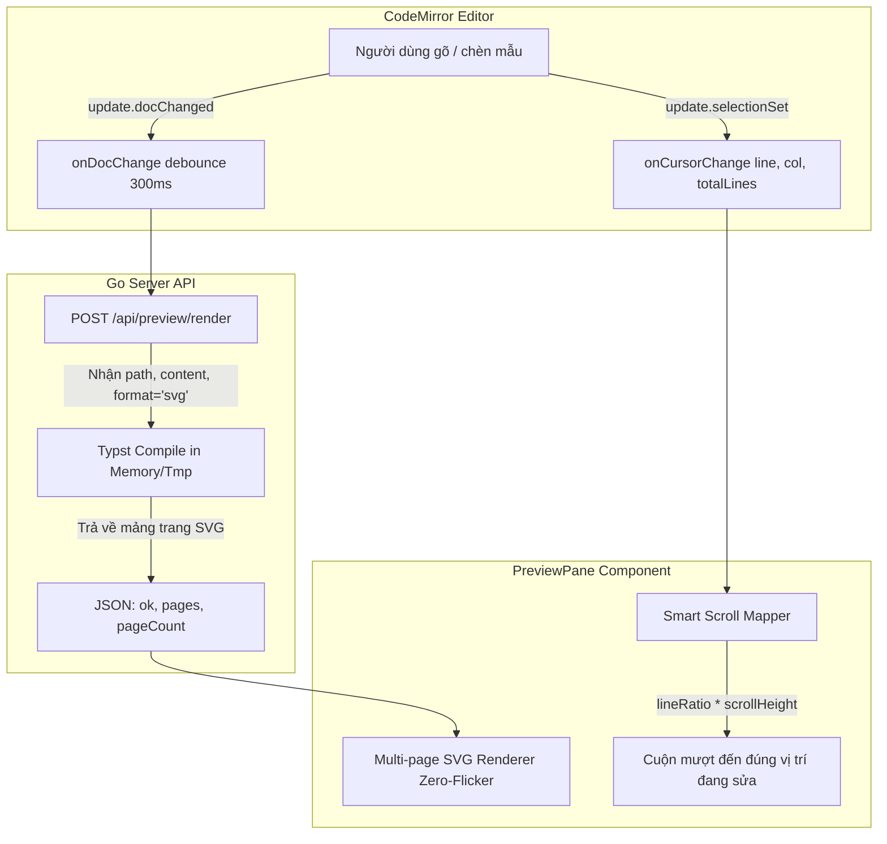

# Kế hoạch Triển khai: Live Instant Preview & Cursor Scroll Sync

## 1. Mục tiêu & Bối cảnh

### Bối cảnh hiện tại
1. **Cập nhật xem trước (Preview update):** Hiện tại, khung xem trước (PreviewPane) chỉ tải lại khi người dùng bấm `Ctrl+S` hoặc nút "Lưu". Khi người dùng đang gõ hoặc chỉnh sửa văn bản, khung xem trước không thay đổi.
2. **Vị trí xem trước (Scroll sync):** Khi biên dịch xong, khung xem trước (sử dụng nhúng `<embed>` PDF) thường trở về đầu trang hoặc không đồng bộ với dòng người dùng đang gõ trong trình soạn thảo.

### Mục tiêu cần đạt
1. **Live Instant Preview (Xem trước tức thì):** Khi người dùng gõ, sửa nội dung hoặc chèn các khối cờ vua / Markdown / bài tập từ thanh công cụ, khung Preview sẽ **tự động biên dịch ngầm và cập nhật ngay lập tức** (với debounce thông minh 300ms chống nghẽn CPU), người dùng **không cần phải bấm lưu (Ctrl+S)** mới thấy kết quả.
2. **Cursor & Edit-Point Sync (Hiển thị ngay tại điểm đã chỉnh sửa):** Khi con trỏ soạn thảo di chuyển hoặc đang gõ ở dòng `L`, khung Preview tự động cuộn mượt mà (**Smooth Scroll Sync**) đến đúng trang và vị trí của đoạn văn bản/bài tập tương ứng.
3. **Trải nghiệm Zero-Flicker & Đa trang (SVG Multi-page Paper View):** Chuyển sang chế độ xem trang SVG đa trang độ nét cao, hiển thị từng trang như tờ giấy in thật với hiệu ứng đổ bóng; khi cập nhật không bị trắng màn hình (flicker) như plugin PDF nhúng.
4. **Tùy chọn linh hoạt:** Cung cấp nút bật/tắt đồng bộ cuộn (🔗 Sync Scroll), công cụ thu phóng (Zoom In/Out/Fit), và nút chuyển đổi xem PDF gốc khi cần in.

---

## 2. Kiến trúc & Thiết kế kỹ thuật



---

## 3. Các thay đổi đề xuất

### A. Backend (Go Server)

#### 1. [NEW] `server/preview_render.go`
* Thêm handler `handlePreviewRender` tiếp nhận request `POST /api/preview/render`.
* Nhận payload JSON:
  ```json
  {
    "path": "test.typ",
    "content": "= Nội dung Typst...",
    "format": "svg"
  }
  ```
* Cơ chế biên dịch:
  * Sử dụng thư mục project root để giải quyết tất cả relative imports và gói `@local/chessbook`.
  * Nếu có `content` (chuỗi văn bản từ editor đang gõ), lưu tạm vào thư mục bộ nhớ tạm để biên dịch mà **không ghi đè file gốc trên đĩa** (giữ nguyên tính toàn vẹn và cờ `dirty` của file).
  * Biên dịch sang các file trang SVG (`page_1.svg`, `page_2.svg`, ...).
  * Đọc nội dung các file SVG và trả về danh sách HTML/SVG cho frontend.
  * Nếu biên dịch lỗi (lỗi cú pháp Typst), trả về `{ "ok": false, "error": "chi tiết lỗi" }` để frontend hiển thị mà không làm mất trang preview trước đó.

#### 2. [MODIFY] `server/server.go`
* Đăng ký route mới:
  ```go
  s.handle("POST /api/preview/render", s.handlePreviewRender)
  ```

---

### B. Frontend (React + TypeScript)

#### 1. [MODIFY] `web/src/components/Editor.tsx`
* Bổ sung prop `onDocChange?: (content: string) => void`.
* Cập nhật `onCursorChange` để truyền thêm `totalLines: number`:
  ```ts
  onCursorChange?.({
    line: line.number,
    col: head - line.from + 1,
    totalLines: state.doc.lines
  })
  ```
* Trong `EditorView.updateListener`: Gọi `onDocChange(newDoc)` khi tài liệu thay đổi.

#### 2. [MODIFY] `web/src/components/PreviewPane.tsx`
* Nâng cấp toàn diện `PreviewPane`:
  * **Chế độ xem SVG đa trang (SVG Paper View):**
    * Render từng trang trong khung giấy card đẹp mắt với bóng đổ và số trang (`Trang 1 / 3`).
    * Cập nhật DOM trực tiếp không chớp nháy (Zero-flicker).
  * **Live Re-render:**
    * Lắng nghe nội dung soạn thảo từ `Workspace` hoặc trigger khi `content` thay đổi.
    * Quản lý trạng thái compile ngầm (`compiling` spinner trên toolbar).
  * **Cursor Scroll Sync (Đồng bộ cuộn tới vị trí con trỏ):**
    * Nhận `cursor: { line, col, totalLines }`.
    * Tính toán:
      $$\text{lineRatio} = \frac{\text{line} - 1}{\max(1, \text{totalLines} - 1)}$$
    * Xác định trang tương ứng và vị trí pixel:
      $$\text{targetTop} = \text{pageCard.offsetTop} + \text{inPageRatio} \times \text{pageCard.offsetHeight} - \frac{\text{container.clientHeight}}{3}$$
    * Thực hiện `scrollContainer.scrollTo({ top: targetTop, behavior: 'smooth' })`.
  * **Thanh công cụ Preview nâng cao:**
    * 🔗 Nút **Đồng bộ cuộn** (Bật / Tắt theo ý muốn).
    * 🔍 Bộ công cụ Zoom: Thu nhỏ (`-`), Phóng to (`+`), Mặc định (`100%`), Vừa chiều rộng (`Fit Width`).
    * 📄 Nút chuyển đổi nhanh sang chế độ PDF hoặc mở tab in.

#### 3. [MODIFY] `web/src/components/Workspace.tsx`
* Kết nối luồng dữ liệu giữa `Editor` và `PreviewPane`:
  * Nhận `onDocChange` từ `Editor`.
  * Áp dụng debounce thông minh (300ms) để gửi `liveContent` sang `PreviewPane`.
  * Khi chèn mẫu cờ vua từ toolbar hoặc modal, thực hiện live render ngay lập tức (0ms).
  * Truyền `cursor` và `totalLines` vào `PreviewPane`.

#### 4. [MODIFY] `web/src/App.css`
* Bổ sung styling chuyên nghiệp cho SVG Paper Preview:
  * `.preview-svg-container`: Khung cuộn với nền xám hiện đại.
  * `.preview-pages-wrapper`: Căn giữa, hỗ trợ zoom transform.
  * `.preview-page-card`: Giả lập trang giấy in thực tế (trắng, đổ bóng `box-shadow`, viền mỏng).
  * `.preview-page-header`: Nhãn số trang tinh tế.
  * `.preview-sync-toggle`: Nút trạng thái đồng bộ cuộn nổi bật.
  * `.preview-zoom-controls`: Bộ nút zoom nhỏ gọn trên toolbar.

#### 5. [MODIFY] `web/src/components/Icon.tsx`
* Bổ sung các icon: `link` (đồng bộ), `unlink` (tắt đồng bộ), `zoom-in`, `zoom-out`, `maximize-2` (fit width).

---

## 4. Kế hoạch Kiểm thử & Xác minh

### A. Kiểm thử Tự động
1. Chạy Vitest trong `web/`: `npm test` để xác minh tất cả 55 unit tests hiện tại tiếp tục pass.
2. Viết thêm unit test trong `web/src/lib/` kiểm tra hàm tính toán vị trí cuộn `calculateScrollTarget(line, totalLines, pageOffsets)`.
3. Chạy `go test ./server/...` để kiểm tra các API routes và server logic.

### B. Kiểm thử Trực quan & Thực tế
1. **Kiểm tra Live Update khi gõ:** Mở tài liệu bất kỳ, gõ thêm đoạn văn bản hoặc tiêu đề mới `= Thử nghiệm` -> Khung xem trước cập nhật hiển thị ngay sau khi dừng gõ ~300ms mà không cần bấm Ctrl+S.
2. **Kiểm tra Cursor Sync:**
   - Di chuyển con trỏ từ đầu trang xuống cuối trang -> Khung xem trước cuộn mượt mà theo con trỏ.
   - Thử nghiệm trên tài liệu nhiều trang: Đặt con trỏ ở trang 2 hoặc 3 -> Preview cuộn ngay đến trang tương ứng.
3. **Kiểm tra Bật/Tắt Sync:** Bấm nút 🔗 để tắt đồng bộ -> Lăn chuột tự do trong preview mà không bị nhảy vị trí theo con trỏ. Bấm bật lại -> Preview lập tức căn chỉnh về vị trí con trỏ hiện tại.
4. **Kiểm tra Zoom & PDF:** Thử zoom 75%, 100%, 125%, Fit và bấm mở PDF.

---

## 5. Triển khai lên VPS Dokploy
1. Commit và push các thay đổi lên branch `main` trên GitHub.
2. Gọi Dokploy API để trigger build & deploy Docker Swarm trên VPS `217.15.160.118`.
3. Kiểm tra log build và xác minh dịch vụ chạy ổn định tại `https://typst.dsc.edu.vn`.
