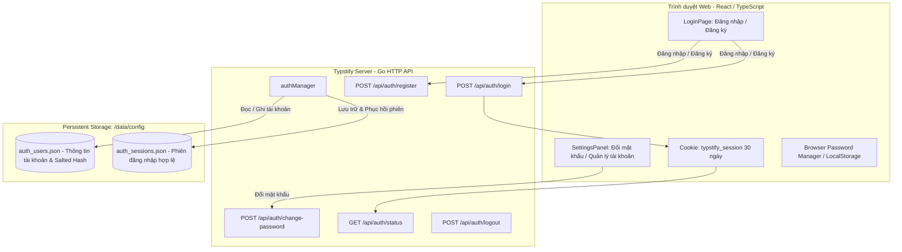

# Kế hoạch Triển khai Tính năng Quản lý Tài khoản, Đổi mật khẩu & Duy trì Đăng nhập cho Typstify

## 1. Tổng quan & Mục tiêu

Hiện tại, Typstify Web phiên bản tự host (self-hosted) sử dụng cơ chế bảo vệ bằng một mật khẩu máy chủ duy nhất (`TYPSTIFY_SERVER_PASSWORD` hoặc cờ `-password`). Phiên đăng nhập (session) chỉ được lưu trữ trong bộ nhớ RAM (`sessions map[string]session`), dẫn đến việc **mỗi lần khởi động lại máy chủ hoặc cập nhật container Docker, toàn bộ phiên làm việc bị xóa và người dùng bị đăng xuất bắt buộc phải nhập lại mật khẩu**. Đồng thời, hệ thống chưa có giao diện và API để tạo tài khoản cá nhân hoặc thay đổi mật khẩu từ web.

Yêu cầu thực hiện:
1. **Tạo tài khoản (User Registration)**: Hỗ trợ đăng ký tài khoản người dùng mới (Username + Password + Display Name).
2. **Thay đổi mật khẩu (Change Password)**: Cho phép người dùng đã đăng nhập thay đổi mật khẩu an toàn trong phần Cài đặt (Settings) hoặc modal tài khoản.
3. **Lưu mật khẩu & Duy trì đăng nhập qua các lần khởi động lại (Session Persistence & Remember Me)**:
   - Lưu trữ người dùng (`auth_users.json`) và phiên đăng nhập (`auth_sessions.json`) xuống file dữ liệu bền vững (`configRoot()` nằm trong volume `/data/config` của Docker) để sau khi restart container hoặc server, người dùng **không bị mất phiên đăng nhập**.
   - Hỗ trợ lưu thông tin đăng nhập trong trình duyệt (hỗ trợ chuẩn `autocomplete="username"` / `autocomplete="current-password"`, `localStorage` và cookie bền vững 30 ngày).
4. **Tài liệu & Hướng dẫn sử dụng**: Viết tài liệu hướng dẫn sử dụng tính năng mới chi tiết tại `docs/USER_AUTH_GUIDE.md` và cập nhật `docs/CHESS_STUDIO_GUIDE.md`.
5. **Đóng gói, Commit, Push & Cập nhật VPS (Dokploy)**:
   - Chạy test Backend Go và Frontend React/Vite.
   - Commit và push lên GitHub (`origin main`).
   - Kích hoạt triển khai lên VPS `217.15.160.118` thông qua Dokploy API (`typst.dsc.edu.vn`).

---

## 2. Thiết kế Kiến trúc & Chi tiết Kỹ thuật



### A. Backend (Go - Package `server` & `service/settings`)

1. **Cấu trúc lưu trữ Tài khoản & Phiên làm việc**:
   - `User`:
     ```go
     type User struct {
         Username     string    `json:"username"`
         DisplayName  string    `json:"displayName,omitempty"`
         PasswordHash string    `json:"passwordHash"`
         Salt         string    `json:"salt"`
         CreatedAt    time.Time `json:"createdAt"`
         UpdatedAt    time.Time `json:"updatedAt"`
     }
     ```
   - **Mã hóa mật khẩu an toàn**:
     Sử dụng hàm băm mật khẩu chuẩn với Salt ngẫu nhiên 16 bytes (`crypto/rand` + SHA-256 / PBKDF2 / Bcrypt) và kiểm tra mật khẩu bằng `crypto/subtle.ConstantTimeCompare` để chống tấn công timing attack.
   - **Lưu trữ bền vững**:
     - `auth_users.json` lưu trong thư mục `configRoot()` (trong Docker là `/data/config/auth_users.json`).
     - `auth_sessions.json` lưu danh sách session token kèm thời hạn `expires` và `created`. Khi server khởi động lại, `authManager` tự động load lại các session chưa hết hạn, giúp giữ đăng nhập thông suốt.

2. **Các API Endpoints**:
   - `POST /api/auth/register`:
     - Nhận: `{ "username": "...", "password": "...", "displayName": "..." }`.
     - Validate: username hợp lệ (chữ cái, số, gạch dưới, min 3 ký tự), password tối thiểu 4 ký tự.
     - Kiểm tra trùng lặp -> Trả lỗi 400 nếu đã tồn tại.
     - Tạo user mới, lưu file `auth_users.json`, tạo session, set cookie và trả về `{ "ok": true, "username": "..." }`.
   - `POST /api/auth/login`:
     - Nhận: `{ "username": "...", "password": "..." }` (hỗ trợ cả trường hợp chỉ gửi `password` cho mật khẩu máy chủ legacy).
     - Xác thực tài khoản trong `auth_users.json` hoặc mật khẩu máy chủ `opts.Password`.
     - Tạo session, lưu `auth_sessions.json`, set cookie `typstify_session` với `MaxAge = 30 ngày`, `HttpOnly`, `SameSite=Lax`.
   - `POST /api/auth/change-password`:
     - Yêu cầu đã đăng nhập (`s.auth.require`).
     - Nhận: `{ "currentPassword": "...", "newPassword": "..." }`.
     - Xác thực mật khẩu cũ, cập nhật băm mật khẩu mới và ghi vào file `auth_users.json`.
   - `GET /api/auth/status`:
     - Trả về `{ "authRequired": bool, "authenticated": bool, "username": string, "displayName": string }`.
   - `POST /api/auth/logout`:
     - Xóa session khỏi file và bộ nhớ, set cookie `MaxAge = -1`.

### B. Frontend (React 19 + TypeScript + Vite)

1. **`LoginPage.tsx`**:
   - Giao diện đăng nhập hiện đại với 2 tab chuyển đổi: **Đăng nhập** và **Đăng ký tài khoản**.
   - Trường nhập:
     - Đăng nhập: Tên đăng nhập (`username`), Mật khẩu (`password`), checkbox "Ghi nhớ mật khẩu".
     - Đăng ký: Tên đăng nhập, Tên hiển thị (tùy chọn), Mật khẩu, Xác nhận lại mật khẩu.
   - Tương thích 100% với các trình quản lý mật khẩu của trình duyệt (Chrome, Edge, Safari, 1Password, Bitwarden) nhờ các thuộc tính chuẩn `autoComplete="username"`, `autoComplete="current-password"`, `autoComplete="new-password"`.
2. **`SettingsPanel.tsx`**:
   - Thêm mục **Tài khoản & Mật khẩu**:
     - Hiển thị thông tin người dùng hiện tại đang đăng nhập.
     - Form đổi mật khẩu: Mật khẩu hiện tại, Mật khẩu mới, Xác nhận mật khẩu mới, nút "Đổi mật khẩu".
     - Nút "Đăng xuất" nhanh.
3. **`App.tsx` & `Workspace.tsx`**:
   - Quản lý trạng thái xác thực và thông tin người dùng đang hoạt động.
   - Hiển thị tên người dùng và avatar/icon trên thanh công cụ / status bar.

---

## 3. Kế hoạch Kiểm thử & Xác thực

1. **Backend Tests**:
   - Viết unit test cho `authManager` trong `server/auth_test.go`:
     - Test đăng ký tài khoản mới thành công.
     - Test đăng ký tài khoản trùng tên bị từ chối.
     - Test đăng nhập đúng/sai mật khẩu, kiểm tra rate limit.
     - Test đổi mật khẩu thành công và xác thực lại bằng mật khẩu mới.
     - Test tính năng phục hồi session từ file (`session persistence`) sau khi khởi tạo lại struct `authManager`.
2. **Frontend Tests & Build**:
   - Chạy `npm test` trong `web/` để đảm bảo 55+ test suite không bị ảnh hưởng.
   - Chạy `npm run build` trong `web/` (`tsc -b && vite build`) để đảm bảo không có lỗi type check và build dist thành công.
3. **End-to-end Local Verification**:
   - Khởi chạy server test cục bộ, thử đăng ký tài khoản `admin`, đăng nhập, tắt server, bật lại server và reload trình duyệt -> xác nhận vẫn giữ trạng thái đăng nhập không cần nhập lại.

---

## 4. Kế hoạch Triển khai lên VPS Dokploy

1. **Git Commit & Push**:
   - `git add .`
   - `git commit -m "feat(auth): add user registration, password change, persistent sessions and user guide"`
   - `git push origin main`
2. **Kích hoạt Dokploy Deploy**:
   - Gửi yêu cầu deploy qua Dokploy tRPC API:
     - Endpoint: `https://dokploy.dsc.edu.vn/api/trpc/application.deploy?batch=1`
     - Header: `x-api-key: typst_appoTVulVTtjNGQppUWoRcWJZVcqzmGmqlzOfvyRaiDdWYhoFrVsWOWKItbqLxleGtj`
     - Application ID: `WBuj5W_mKFsnuzVkHZGYO` (`typstify-web`)
   - Hoặc kiểm tra qua SSH `root@217.15.160.118` để theo dõi tiến trình build và container restart.
3. **Xác nhận trạng thái Production**:
   - Kiểm tra `curl -I https://typst.dsc.edu.vn/api/health` -> HTTP 200.
   - Truy cập `https://typst.dsc.edu.vn` xác nhận giao diện Đăng nhập / Đăng ký hoạt động mượt mà.

---

## 5. Danh mục File thay đổi

| Loại | File | Mục đích |
|---|---|---|
| MỚI | `docs/plans/plan_user_auth_and_persistence.md` | Tài liệu kế hoạch kỹ thuật |
| MỚI | `docs/USER_AUTH_GUIDE.md` | Hướng dẫn sử dụng tính năng tạo tài khoản, đổi mật khẩu và lưu mật khẩu |
| SỬA | `server/auth.go` | Bổ sung quản lý User, File Storage cho User và Session, API Register, Change Password |
| MỚI | `server/auth_test.go` | Unit test cho toàn bộ logic đăng ký, đăng nhập, đổi mật khẩu và session persistence |
| SỬA | `server/server.go` | Đăng ký route mới `/api/auth/register`, `/api/auth/change-password` và truyền config path |
| SỬA | `web/src/api/types.ts` | Khai báo kiểu dữ liệu cho User, AuthStatus, RegisterRequest, ChangePasswordRequest |
| SỬA | `web/src/components/LoginPage.tsx` | Nâng cấp giao diện hỗ trợ Đăng nhập / Đăng ký / Ghi nhớ mật khẩu |
| SỬA | `web/src/components/SettingsPanel.tsx` | Thêm phần Đổi mật khẩu & Quản lý phiên đăng nhập |
| SỬA | `web/src/components/Workspace.tsx` / `StatusBar.tsx` | Hiển thị thông tin người dùng và nút đăng xuất |
| SỬA | `docs/CHESS_STUDIO_GUIDE.md` | Cập nhật hướng dẫn tổng thể Chess Studio |
